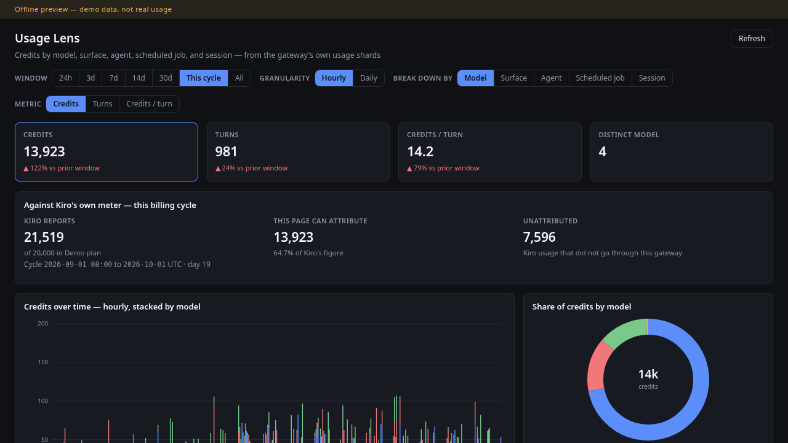
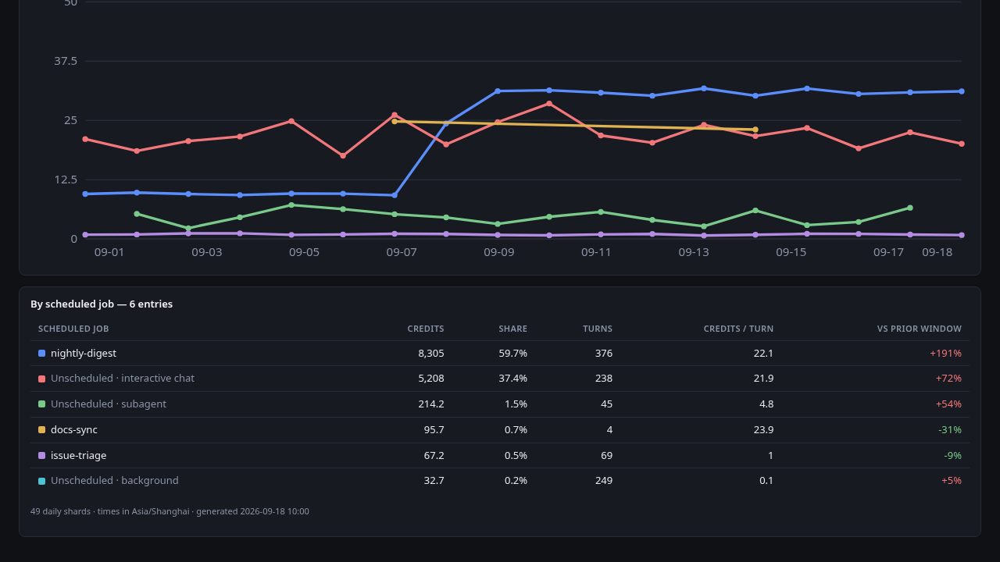

# Usage Lens


A Kiro Crew app that answers one question: **where did the credits go?**

The gateway already writes one row per agent turn to `<data home>/usage/tokens/YYYY-MM-DD.jsonl`,
carrying the model, the surface, the agent, the session slot, and the credits that turn
cost. The built-in Spend view rolls that up by model, channel, and session over a fixed
7-day window. Usage Lens reads the same shards and adds the cuts that view does not have:

- **Per scheduled job.** A cron with `persistent_session=false` gets a fresh slot per run
  (`cron:<job id>:<run id>`), so a job that fires every 15 minutes shows up as ~2,900
  anonymous background rows a month. Usage Lens rolls those up by job id and names them
  from `crons.json`, so one job is one row.
- **Per agent**, which nothing else surfaces — useful when several agents share one model.
- **Any window at any granularity**: 24h / 3d / 7d / 14d / 30d / this billing cycle / all,
  hourly or daily, every figure compared against the preceding window of equal length — and for
  the cycle window, against the PRECEDING cycle, so "vs prior" means what the invoice means.
- **Reconciliation against Kiro's own meter.** On the cycle window the page shows Kiro's
  month-to-date credits beside what it can attribute locally, and names the remainder for
  what it is: usage that did not go through this gateway (the Kiro IDE, or a `kiro-cli`
  session you drive yourself). The two are not supposed to match; the gap is the finding.
- **Credits per turn**, plotted per day — the cut that separates the same work costing more
  from doing more work, which the totals alone cannot tell apart.

Read-only by construction: no writes, and the manifest declares no storage, cron, spawn,
or network permission.

## What it looks like



Broken down by **model**, on the current billing cycle: totals with their change against
the same elapsed span of the previous cycle, Kiro's own meter beside what the page can
account for, credits over time, share of credits, credits per turn, and the full table.



The same cycle broken down by **scheduled job**, daily. One cron that runs every 30 minutes
is 59.7% of the spend on its own; the rows prefixed `Unscheduled ·` are not jobs and say
which kind of work they were.

Both screenshots are the real built page rendered by the offline preview
(`npm run preview`) over **demo data**, not anyone's real usage: a screenshot from a real
payload would publish session titles, cron job names, and actual spend.

## Install

```bash
npm install          # esbuild + typescript, for the UI bundle
npm run check        # typecheck, build ui/index.mjs, then 191 tests
kirocrew app install /path/to/kirocrew-usage-lens
kirocrew app enable usage-lens
```

`kirocrew app enable` is refused while third-party app execution is off, because this app
ships Python that runs inside the gateway process. Either trust this one app
(`agent.apps_trusted`, in Settings) or set `agent.apps_allow_third_party=true` to allow
every third-party app's code. That gate is deliberate — read `backend/` before you open it.

The page then appears in the sidebar at `/usage-lens`.

> **Changing the backend needs a gateway restart.** `kirocrew app install` (and the update
> endpoint) copy the files and re-register the routes, but the Python module is already in
> the gateway's `sys.modules`, so edited backend code does not take effect until
> `kirocrew restart`. UI-only changes need just a browser reload.

## Installing it somewhere else

Three paths, in increasing order of how many people they serve:

1. **From a local clone** — what the block above does. `kirocrew app install <dir>` reads
   `app.json`, copies the app in, and registers it. Nothing is built at install time
   because `ui/index.mjs` is committed, so no install script has to be trusted.

2. **As a federated registry** — this repo carries an `app-registry.json` at its root that
   points at itself, which is the index format KiroCrew's App Store reads. Add the repo as
   a registry (dashboard → Apps, or `PUT /api/apps/registries`) and the app appears in the
   store for anyone in that install, with its description, highlights, and use cases coming
   from `app.json` rather than from the index. The registry entry is just
   `{name, gitUrl, branch}`; install clones that branch.

3. **In KiroCrew's bundled catalogue** — `kiro_crew/apps/app-registry.json` inside the
   released package is a curated index of community apps (the same four fields). Getting
   listed there is a pull request against KiroCrew itself, not something an app can do for
   itself. There is no documented submission form; the existing entries are the precedent.

Whichever path, an installing user still meets the execution-policy gate, because the app
has a Python backend. An app with a UI and no backend would not — but then it could not
read the shards.

## Testing

```bash
npm test              # both suites
npm run test:backend  # 107 cases, stdlib unittest, no pytest
npm run test:ui       # 84 cases, node:test, no jsdom
npm run check         # typecheck + build + both suites
```

Every backend test builds its own shard directory in a temp dir, so the suite never reads
the developer's real usage data and passes on a machine that has never run KiroCrew. CI
runs the backend on Python 3.9 / 3.11 / 3.13 and the frontend on Node 20 / 22, asserts the
backend imports nothing outside the stdlib, and fails if the committed `ui/index.mjs` does
not match `src/`.

What the suites deliberately cover, because each one was a real defect or a real hazard:

| Area | Cases include |
|---|---|
| Shard parsing | malformed JSON, JSON scalars, wrong `_type`, missing/unparseable/`Z`-suffixed/naive timestamps, invalid UTF-8, no trailing newline, an unreadable shard, a non-date filename, a directory named like a shard |
| Credits | `NaN`, `±Infinity`, `null`, missing, a numeric string (refused, not coerced), a list/dict, `True`, a negative refund, `1e15` |
| Windows | every advertised window, an unsupported value clamping, a shard past the lookback ceiling, boundary rows one hour either side |
| Timezones | UTC vs `+08:00` vs a `+05:45` offset, a DST zone, an unknown zone name, the same instant landing on different hour keys |
| Billing cycle | a January reset walking back a year, February's short month, a leap year, a mid-month anniversary, a datetime-shaped value, six unusable values, `_shift_months` round-tripping every month |
| Job dimension | per-run vs persistent cron slots rolling up to one job, a deleted job id, an empty registry name, `cron:` with no id, eleven unscheduled classifications, a job named like a surface, five corrupt registry shapes |
| Official figures | an absent host cache, an `{"available": false}` sentinel, a raising cache, and that identity fields (`email`, `start_url`, `account`) never travel to the UI |
| Caching | a repeat read served from cache, an append invalidating it, window and timezone as separate keys, every shard deleted |
| Payload invariants | row width, index bounds, credit and turn reconciliation, bucket dedup, JSON round-trip with `allow_nan=False`, sorted hour keys |
| Scale | 20,000 rows folding in under a second, and folding actually reducing the row count |
| Frontend | formatting at every threshold, per-turn on a turnless cell, tie-breaking, delta against a zero prior, hour-key arithmetic, a payload from an older backend, and SVG geometry with no `NaN` for empty / single-point / all-null / all-zero / negative / 1e12 inputs |
| Assets | every SVG parses as XML and carries no `--` in a comment; the glyph is square, labelled, uses only the two sanctioned colours and avoids `currentColor`; the store icon is square, 512px and opaque; hero art is 16:9 and detail art 25:6 in both appearances, with light and dark genuinely different files; screenshots are landscape and ≥1000px wide; every declared art path is repo-relative, servable by the blob proxy, and exists; the backend hook resolves to a real function; no capability is declared that the app does not need; the registry index agrees with the manifest |

## How it works

```
usage/tokens/*.jsonl          one JSONL row per agent turn, written by the gateway
        │
        ▼
backend/usage_store.py        folds turn rows into
                              hour x model x surface x agent x job x session buckets,
                              interns each dimension, caches on (shard, mtime, size)
        │  GET /api/apps/usage-lens/series?days=0&tz=<IANA>
        ▼
src/model.ts                  every window / dimension / metric switch is a re-slice of
                              that one payload — no refetch
        │
        ▼
src/charts.tsx                inline SVG with a fixed viewBox: no charting dependency,
                              and no canvas/container sizing feedback loop
```

Design notes worth knowing before you extend it:

- **`credits` is the only cost metric that is always populated.** `cost` (USD) and the
  `input` / `output` token counts are written by the `claude_code` and `bedrock` providers
  only; on ACP turns they are `0`, so a token- or dollar-based view reads as "free" on the
  default provider.
- **Subagent turns cannot be attributed to their parent.** The row carries no pointer back
  to the session that spawned it, so a subagent appears under the `subagent` surface and
  nowhere else. Unlike the built-in Spend panel, Usage Lens still *counts* those credits —
  money with no row is worse than a row you have to interpret.
- **Older shards can hold bare `NaN` / `Infinity`.** `json.loads` accepts those, and one
  would poison every total it touches and produce a body the browser cannot parse, so such
  rows are dropped.
- **The cycle boundary is a UTC instant, not local midnight.** Kiro resets plan credits at the
  start of the billing cycle and reports that instant (`nextDateReset`) in UTC, so a naive
  local-month filter misfiles every turn in the offset band — eight hours' worth in
  Asia/Shanghai, measured at ~350 credits on one real cycle. The backend does the month
  arithmetic in UTC and converts the boundaries to the display zone before they leave.
- **Hour keys are pre-converted to the requested zone** and compared as strings, so the
  UI's day boundaries fall where the reader's own midnight is (it passes the browser's
  zone). Window arithmetic anchors on the newest row, not `Date.now()`, so the view stays
  meaningful on a gateway that has been idle.

## Offline preview

```bash
npm run preview      # builds and serves http://127.0.0.1:8977/
```

Renders the real page — the same `src/`, the same charts, the same arithmetic — outside the
dashboard, against a deterministic demo payload. The two host modules the dashboard normally
supplies through its import map are aliased to stand-ins under `tools/preview/`, and react is
bundled in, so nothing needs a gateway, a token, or a network.

Use it to iterate on the UI without restarting anything, and to take screenshots without
publishing real usage data. `tools/demo_payload.py` regenerates the payload; it is
seeded, so the same input always produces the same picture.

> Changing the BACKEND still needs a gateway restart (see the note above). The preview only
> covers the page.

## Standalone HTML export

`tools/export-html.py` writes the same analysis as one self-contained HTML file — useful
when you want a snapshot to keep, mail, or read without the gateway running:

```bash
python3 tools/export-html.py --out ~/usage.html [--days 30] [--tz Asia/Shanghai]
```

It embeds the aggregated data and pulls Chart.js from jsdelivr; it needs no server and
makes no other network calls.

## Layout

```
app.json                 manifest: one UI page, one backend route hook, no other permissions
backend/usage_store.py   shard reader + fold (stdlib only)
backend/routes.py        GET /series, GET /health  (paths are relative to /api/apps/usage-lens)
tests/test_usage_store.py  84 backend cases (stdlib unittest)
tests/frontend.test.mjs    74 frontend cases (node:test, server-rendered SVG)
tests/fixture.py           dumps a real /series payload, or a synthetic one on a fresh host
app-registry.json          registry index so this repo can be added as an App Store source
.github/workflows/check.yml  CI: 3 Python versions, 2 Node versions, manifest sanity
src/                     the page: model.ts (arithmetic), charts.tsx (SVG), index.tsx (layout)
scripts/build.mjs        esbuild -> ui/index.mjs, host modules external
tools/export-html.py     standalone HTML export
tools/demo_payload.py    seeded demo payload for the offline preview
tools/preview/           host-module stand-ins + the preview shell
scripts/preview.mjs      builds and serves the offline preview
docs/                    the screenshots this README embeds
ui/index.mjs             the built artifact app.json points at (tracked on purpose)
ui/icon.svg              16px sidebar glyph (transparent)
ui/icon-store.svg        512px opaque store icon
ui/hero-{light,dark}.svg          16:9 store art
ui/hero-detail-{light,dark}.svg   25:6 detail banner
```

## Licence

MIT.
